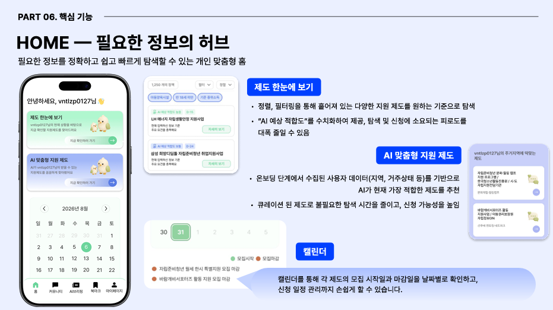
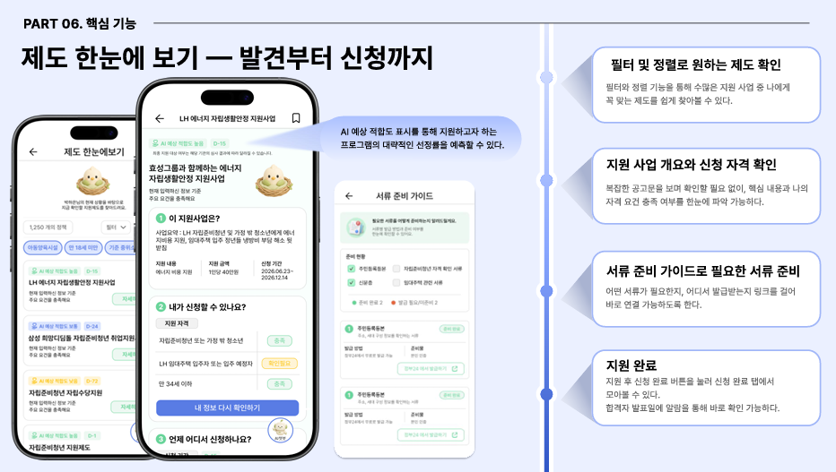
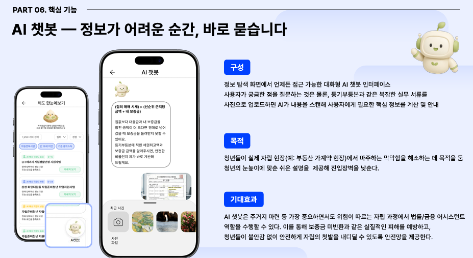
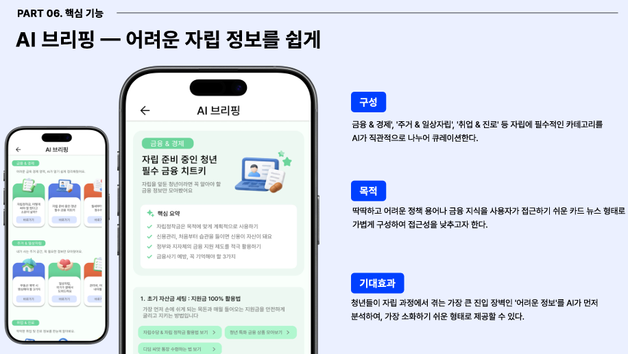

# 🕊️ Fledge

<div align="center">

## 🏆 멋쟁이사자처럼 대학 14기 중앙 해커톤 입상

**ANIMAL LEAGUE · OPEN TRACK**  
동덕여자대학교 **Team Queen**

<br/>


### 자립의 첫 걸음, 나에게 필요한 정보를 한 번에

**자립준비청년을 위한 AI 기반 맞춤형 자립 지원 서비스**

<br/>

[🌐 **서비스 바로가기**](https://dwllch-fe.vercel.app/)
&nbsp;&nbsp; | &nbsp;&nbsp;
[📑 **발표자료 보기**](./docs/Fledge.pdf)

<br/>


</div>

---

## 📌 About

**Fledge**는 자립준비청년이 복잡하게 흩어진 지원 정보를 직접 찾아다니지 않고,  
자신에게 필요한 정책을 확인하고 실제 신청까지 이어갈 수 있도록 돕는 서비스입니다.

> **맞춤 정보 추천 → 자격 확인 → 서류 준비 → 신청 행동**

단순한 정보 제공을 넘어  
사용자의 **다음 행동까지 연결하는 것**을 목표로 합니다.

---

## Key Features

### 맞춤형 HOME

<div align="center">

</div>

- 사용자 정보를 기반으로 한 **AI 맞춤 정책 추천**
- 정책 필터 및 정렬
- AI 예상 적합도 제공
- 모집 및 마감 일정 캘린더 관리

---

### 제도 한눈에 보기

<div align="center">

</div>

- 지원 사업 핵심 정보 제공
- 사용자별 자격 충족 여부 확인
- 필요한 서류 및 발급 방법 안내
- 신청 페이지 연결 및 신청 상태 관리

---

### AI 챗봇

<div align="center">

</div>

- 정책 및 지원 자격 질문
- 주거·금융 관련 정보 안내
- 복잡한 정책 및 실무 정보를 이해하기 쉽게 설명

---

### AI 브리핑

<div align="center">

</div>

자립에 필요한 정보를 AI가 이해하기 쉬운 형태로 큐레이션합니다.

- 금융 & 경제
- 주거 & 일상 자립
- 취업 & 진로

---

## Tech Stack

| Category | Stack |
| --- | --- |
| Language | Python 3.10 |
| Framework | Django 5.2 |
| API | Django REST Framework |
| Version Control | Git / GitHub |

---

## Backend Structure

```text
FLEDGE_BE/
├── b2g/
├── briefing/
├── chat/
├── common/
├── community/
├── config/
├── home/
├── mypage/
├── users/
├── manage.py
└── requirements.txt
```

---

## Run

```bash
git clone https://github.com/jiwoolee211/FLEDGE_BE.git
cd FLEDGE_BE

python -m venv venv
venv\Scripts\activate

pip install -r requirements.txt
python manage.py migrate
python manage.py runserver
```


---

<div align="center">

### 혼자 살아도, 혼자 결정하지 않도록.

[🌐 **Live Demo**](https://dwllch-fe.vercel.app/)
&nbsp;&nbsp;•&nbsp;&nbsp;
[📑 **Presentation**](./docs/Fledge_presentation.pdf)

</div>
